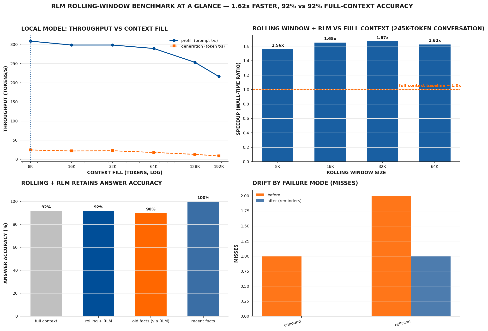

# RLM Rolling-Window Benchmark

Keep a long-running model conversation inside a small working window by rolling the
context and re-injecting the important facts from a durable memory — and measure what
that costs in speed, what it costs in accuracy, and where the facts get lost.

**Headline result:** on a 245,760-token conversation, a rolling window of **32,768
tokens with an RLM context gate runs 1.67× faster** than the same conversation in a
single full context (12,148 s vs 20,242 s), while keeping answer accuracy within
**0.000 of the full-context baseline** (92% vs 92%).



*One graph that summarises everything: throughput vs context (top-left), rolling-window
speedup vs full context (top-right), answer accuracy retained (bottom-left), and drift
misses before vs after reminders (bottom-right).*

## Why

Long conversations are the main user-facing cost of an LLM service. Prefill throughput
collapses as the context grows — on a mid-range GPU (8 GB) with a 35B MoE model the
generation rate more than halves from 8 K to 196 K context (24.4 → 8.7 tokens/s). One
response: keep the *working* context small and roll it forward, moving what still
matters into a durable side memory instead of paying KV-cache and attention costs for
everything the conversation ever said.

That is the idea this benchmark measures. The memory is the **RLM context gate** — a
30/60/90% of the window is compacted into summaries, the summaries are re-injected into
the next window, and anything the model still needs is surfaced as a *reminder* keyed
by how far it has drifted.

## Results

### Speed sweep (prefill & generation vs context size)

| Context (tokens) | Prefill t/s | Generation t/s | GPU util % |
| --- | --- | --- | --- |
| 8,192 | **308.3** | 24.4 | 79 |
| 16,384 | 298.1 | 21.6 | 77 |
| 32,768 | 298.1 | 22.3 | 81 |
| 65,536 | 289.2 | 17.9 | 83.5 |
| 131,072 | 253.1 | 12.9 | 83 |
| 196,608 | 215.9 | 8.7 | 81 |

### Rolling-window comparison (245,760-token conversation)

| Mode | Window | Wall time (s) | Combined t/s | Gate deposits | Speedup |
| --- | --- | --- | --- | --- | --- |
| Full context | 245,760 | 20,242 | 12.14 | — | 1.00× |
| Rolling + RLM | 8,192 | 12,976 | 18.94 | 100 | 1.56× |
| Rolling + RLM | 16,384 | 12,258 | 20.05 | 49 | 1.65× |
| Rolling + RLM | **32,768** | **12,148** | **20.23** | **24** | **1.67×** |
| Rolling + RLM | 65,536 | 12,466 | 19.71 | 12 | 1.62× |

### Accuracy (12-fact conversation, `results/eval_after_summary.json`)

| Metric | Value |
| --- | --- |
| Full-context accuracy | 92% |
| Rolling + RLM accuracy | **92%** |
| Accuracy gap | 0.000 |
| Old-fact accuracy (via RLM) | 90% |
| Recent-fact accuracy | 100% |

Without reminders, the rolling model misses 3/12 facts (75% accuracy); with RLM
reminders it misses 1/12 (92% — equal to full context). See
`results/drift_profile.json` and `figures/drift_distribution.png`.

## How the RLM context gate works

1. The conversation runs in a small window (e.g. 32,768 tokens).
2. When context fill crosses **30%**, the oldest portion is summarized; when it crosses
   **60%** and **90%**, the same happens again (a *gate deposit*).
3. Summaries accumulate in a side memory and are re-injected into the next window.
4. **Reminders** codify each fact as `key|emoji|value` and add the pair back to the
   context once per quarter it has drifted into the *forget landscape* — the further a
   fact ages, the more often it is reminded. The emoji per key is chosen by the model
   each run (see `legend` in `eval_after_summary.json`), so the codification stays
   self-generated rather than hardcoded.
5. Gate accounting re-arms after each 90% compaction.

The drift analysis classifies every missed fact by **mode** (`absent`, `unbound`,
`collision`, `paraphrased`, `stale`, `hallucinated`) and **shape** (`number:unit`,
`word`, `abbrev`, `letter_number:context`, …), then reports recall per forget-quarter.

## Reproducing

Requirements: Python ≥ 3.10, `numpy`, `matplotlib`, `requests` (see
`requirements.txt`). The benchmark needs a llama.cpp server on `:8082` (override with
`RLM_BENCH_SERVER`) running `Qwen3.6-35B-A3B-UD-IQ2_M.gguf` with `n_ctx ≥ 250112` and
`--metrics` enabled.

```bash
pip install -r requirements.txt

# 1. Speed sweep (prefill/gen/GPU vs context size) — writes results/context_speed_sweep.csv
python -m src.sweep

# 2. Rolling-window wall-clock comparison — writes results/rolling_window_comparison.csv
python -m src.rolling_window

# 3. A/B accuracy eval (full context vs rolling+RLM, with and without reminders)
#    and full analysis: drift profile, all figures, SUMMARY.md
python -m src.analyze
```

Structural check that every figure uses the Pumpkin Spice theme:

```bash
python scripts/check_figures.py
```

Tests (self-contained, no pytest needed):

```bash
python - <<'PY'
import importlib.util, pathlib
spec = importlib.util.spec_from_file_location("t", "tests/test_benchmark.py")
m = importlib.util.module_from_spec(spec); spec.loader.exec_module(m)
PY
```

## Repository layout

```
src/theme.py          Pumpkin Spice palette + matplotlib theme (single source of truth)
src/sweep.py          context-size sweep → results/context_speed_sweep.csv
src/rolling_window.py rolling-window wall-clock comparison → comparison CSV
src/drift.py          drift taxonomy, forget-landscape quarters, reminders
src/eval.py           A/B accuracy eval, RLM summaries, model-chosen emoji codification
src/analyze.py        runs both evals, builds drift profile + figures + SUMMARY.md
src/figures.py        Pumpkin-Spice-themed figures incl. overview + drift_distribution
scripts/check_figures.py  structural verification of generated PNGs
tests/test_benchmark.py   21 unit tests (drift taxonomy, reminders, quarter math, …)
results/             CSVs, JSON summaries, drift profile, SUMMARY.md
figures/             all figures
```

## Limitations

- Single model, single GPU, single synthetic conversation. The accuracy numbers are a
  demonstration, not a population estimate.
- The 245,760-token sweep point is unreachable on this server (prompt construction
  overshoots the 250,112 `n_ctx`), so the comparison baseline is capped at 196,608.
- YaRN-based alternatives (longer native window at 4× RoPE, or 128 K + YaRN) are
  **not** benchmarked here; they are scoped as future work (see `arxiv_paper.tex`).

## Acknowledgements

The **RLM** (recursive language model) concept this benchmark builds on — persistent
IPython as the model's programming surface, prompt-as-a-variable, and the Continual
Harness for durable memory — originates from **PrimeIntellect's open-source
[prime-agent](https://github.com/PrimeIntellect-ai/prime-agent)** (MIT, 2026; Continual
Harness, [arXiv:2605.09998](https://arxiv.org/abs/2605.09998)). This project evaluates a
rolling-window adaptation of that memory concept; the terms *RLM context gate* and
*RLM rolling-window benchmark* are used here in that derived sense. We thank the
prime-agent authors for making the RLM abstraction public.

## License

MIT — see `LICENSE`.
